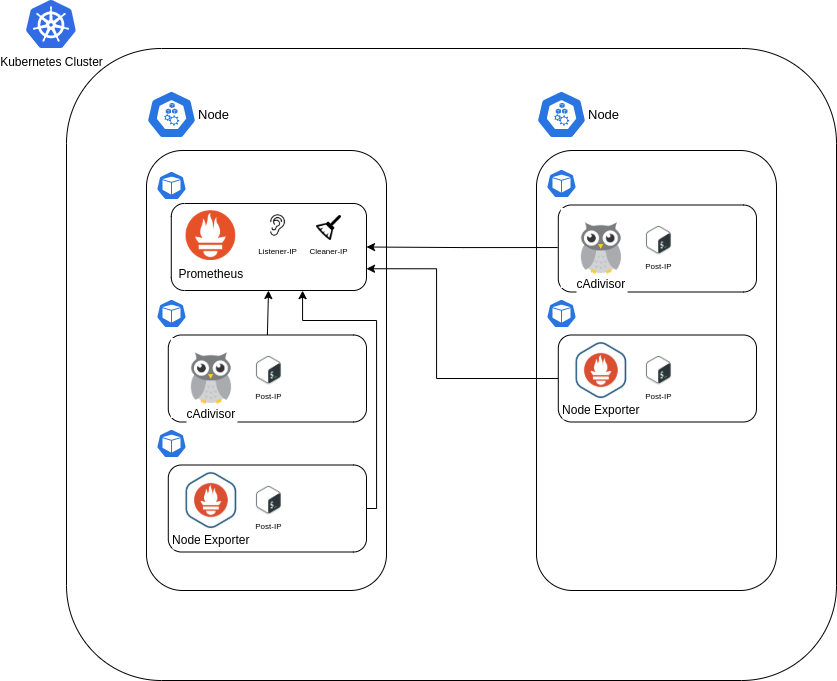

# k8s-monitor

## Kubernetes Monitoring Stack.

<br>

## <ins>Overview</ins>
k8s-monitor is an open-source system for monitoring Kubernetes Node and Pod infrastructure. The system was designed and developed to allow a simple installation, which does not need to configure access to the cluster and be prepared for components auto-scaling like PODs and HPAs, as well as for the auto-scaling of kubernetes Nodes, registering and automatically monitoring new features. 

## <ins>Components</ins>

- Prometheus
- Cadvisor
- Node Exporter
- Listener
- Post-IP
- Cleaner-IP

<br>

## <ins>Install</ins>

### <b>1 - Automatic Installation</b>

In order to install k8s-monitor in a faster and more automatic way, a script was developed that installs all the components, in the correct order necessary, to work the metrics collection.

To install or remove the monitoring system using the script, <b>it is necessary to log into the cluster</b> with the kubernetes cli ([kubectl](https://kubernetes.io/docs/tasks/tools/)) and then run the script with this parameters: 

<br>

To install:<br>
```
bash setup.sh install
```

To remove:<br>
```
bash setup.sh uninstall
```

If you are not logged into kubernetes, the script will return an error. 

<br>

### <b>2 - Manual Installation</b>

If you prefer to install component by component manually, you must respect the installation order of some components for k8s-monitor to work correctly and collect all metrics.

It needs to be installed in the following order: 1st Create Namespace, 2nd Cadvisor, 3rd Node Exporter and 4th Prometheus. 

1° - Namespace<br>
Create namespace k8s-monitor:<br>
```
kubectl apply -f cadvisor/namespace.yaml
```

2° - Cadvisor<br>
Install the following components in the order described below: <br>
```
kubectl apply -f cadvisor/clusterrole.yaml
kubectl apply -f cadvisor/clusterrolebinding.yaml
kubectl apply -f cadvisor/podsecuritypolicy.yaml
kubectl apply -f cadvisor/serviceaccount.yaml
kubectl apply -f cadvisor/daemonset.yaml
```

3° - Node Exporter<br>
Install the following components in the order described below: <br>
```
kubectl apply -f node-exporter/ne-daemonset.yaml
```

4° - Prometheus<br>
Install the following components in the order described below: 
```
kubectl apply -f prometheus/prom-service.yaml
kubectl apply -f prometheus/prom-config-confmap.yaml
kubectl apply -f prometheus/prom-pvc.yaml
kubectl apply -f prometheus/prom-statefulset.yaml
```

At the end of the installation of all components, the k8s-monitor will be collecting the cluster infrastructure metrics. Prometheus can be accessed via the `prometheus-k8s-service` service.

If you want to use Grafana to view metrics, the following dashboards to [Node](https://grafana.com/grafana/dashboards/14753) and [POD](https://grafana.com/grafana/dashboards/14754) have been developed. 

<br>

## <ins>Architecture</ins>



<br>

## <ins>How it works</ins>

Basically, k8s-monitor uses the prometheus + cadvisor + node-exporter stack to expose the infrastructure metrics of the cluster's Nodes and PODs, with the addition of Listener-IP and Post-IP for prometheus to register the new Nodes and PODs that can dynamically join and leave the cluster through auto-scaling.

With this approach, it is not necessary to inform the [kubernetes_sd_config](https://prometheus.io/docs/prometheus/latest/configuration/configuration/#kubernetes_sd_config) to prometheus, as it is no longer responsible for discovering the IPs of the kubernetes services, but by just listening and recording the addresses of these components.

When uploading the statefulset that contains the prometheus, in the yaml artifact, there are 2 more containers: [Listener](https://hub.docker.com/r/pablommr/listener) and [Cleaner-IP](https://hub.docker.com/r/pablommr/cleaner-ip).

<br>

### Listener
The Listener is a container that runs on the same pod as the promehtues along with the cleaner-ip. It was developed using [Node.js](https://nodejs.org/) and is responsible for exposing a port that listens to POST requests coming from [Post-IP](https://hub.docker.com/r/pablommr/post-ip) in the cadvisor and node-exporter pods.

Example of a call that must be made to the listener by post-ip: 

`curl -X POST http://$SERVICEPROM/$URLPARAM?ip=$IP:$PORT`

$SERVICEPROM = prometheus service DNS<br>
$URLPARAM = Can be cadvisor or node-exporter values<br>
$IP = POD IP<br>
$PORT = POD exposed port<br>

All these variables are set in Post-IP.

When receiving requests, Listerner writes the IP in the targets-cadvisor.json or targets-nodeexport.json file, depending on the $URLPARAM variable. These files are on a volume shared with Prometheus, and when registering a new ip, either coming from Cadvisor or coming from Node-Exporter, it is written in JSON format which is configured in prometheus.yml. These files are [file_sd_configs](https://prometheus.io/docs/prometheus/latest/configuration/configuration/#file_sd_config), which are type specific files that Prometheus can read to dynamically add or remove hosts.

When receiving the IP, the Listener checks the file if the IP exists, if the IP is not in the list, it is added in the last position in the JSON field, and if it already exists, no action is taken. 

<br>

### Post-IP
The Post-IP is a container responsible for getting the IP of the pod (Cadvisor and Node-Exporter) and sending it to the Listener through a POST request.

Post-IP captures the POD IP through a variable using [downward-api](https://kubernetes.io/docs/tasks/inject-data-application/downward-api-volume-expose-pod-information/#the-downward-api) of the kubernetes. With the IP and the declared value in another variable informing if the Post-IP is or in the Cadvisor in the Node-exportes, the Post-IP then makes a POST request to the Listener:

Request example: 

`curl -X POST http://$SERVICEPROM/$URLPARAM?ip=$IP:$PORT`

The Request is made once every 5 minutes. This way, if there is any problem with prometheus, such as a restart, it is guaranteed that the IP will always be registered. 

<br>

### Cleaner-IP
Due to the auto-scaling in kubernetes, new ips are periodically registered in Prometheus, causing it to try to collect metrics from all nodes. When a node is automatically removed from the cluster, the ip is stored in prometheus' IP list, and when trying to collect metrics from a node that no longer exists, prometheus takes timeout.

To solve this problem, Cleaner-IP was developed, which checks all Nodes once a day. It lists the IPs that are in the targets-cadvisor.json and targets-nodeexport.json files and tests if the Nodes exist, and if the is not responsive, the IP is removed from the file, making prometheus not try to collect more metrics of the non-existent nodes. 

<br>

## <ins>Links</ins>

[Prometheus](https://prometheus.io/)

[Cadvisor](https://github.com/google/cadvisor/releases)

[Node-Exporter](https://github.com/prometheus/node_exporter)

[Listener](https://hub.docker.com/r/pablommr/listener)

[Post-IP](https://hub.docker.com/r/pablommr/post-ip)

[Cleaner-IP](https://hub.docker.com/r/pablommr/cleaner-ip)

[Grafana - Node](https://grafana.com/grafana/dashboards/14753)

[Grafana - Pod](https://grafana.com/grafana/dashboards/14754)